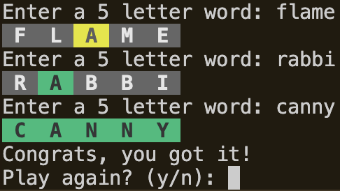

# 📝 Wordle CLI
A simple command-line Wordle game in Python. 

## 🧑🏻‍💻 Why did I make this?
I enjoy Wordle and wanted a lightweight way to play directly from the terminal.

## 🤩 Features
- Fully playable Wordle clone in the terminal
- Packaged as a reusable CLI using `uv`
- Randomly selected 5-letter word per game
- Correct Wordle feedback rules (green, yellow, gray)
- Colored terminal output using ANSI escape codes
- Input validation without consuming attempts
- Six-attempt limit per game
- Replay prompt after win or loss
- CLI interface with `--start` and `--help`

## 📝 Requirements
- Python 3.13+
- uv package manager

## 🧑‍🔧 Demo Instructions
### Option 1: Install Globally with uv tool
Install and run Wordle anywhere on your system:
```bash
# Install uv (if you haven't already)
curl -LsSf https://astral.sh/uv/install.sh | sh

# Install Wordle globally from source
git clone <repository-url>
cd wordle-cli
uv tool install --from . wordle-cli
```
Once installed, run Wordle:
```bash
wordle --start # Start a game
wordle --help  # Rules and how to play
```

### Option 2: Run Locally Without Installing
For local use:
```bash
git clone <repository-url>
cd wordle-cli
```
Once installed, run Wordle:
```bash
uv run wordle --start # Start a game
uv run wordle --help  # Rules and how to play
```

## 📸 Preview


## 🧑‍🔧 Project Structure
```
wordle-cli/
├── assets/
│   └── preview.png          # Screenshot preview of the CLI gameplay
├── data/
│   └── words.txt            # Custom list of valid 5-letter words
├── docs/
│   └── specs.md             # Project requirements and design specifications
├── src/
│   └── wordle/
│       ├── __init__.py      # Marks the wordle package
│       └── main.py          # Core game logic and CLI entrypoint
├── tests/
│   └── __init__.py          # Placeholder for future tests
├── pyproject.toml           # Project metadata and CLI configuration
├── uv.lock                  # uv lockfile for reproducible environments
├── LICENSE                  # Project license
└── README.md                # Project documentation
```

## 📄 License
This project is licensed under the terms of the MIT License.
